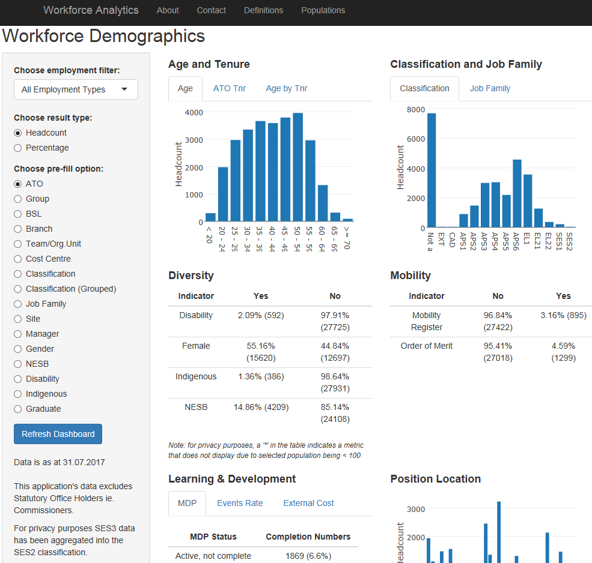

# Workforce Demographics

View a range of workforce related demographics information across the organisation.



## Prerequisites

This application requires an instance of [Shiny Server](https://www.rstudio.com/products/shiny/shiny-server/)
and the dependencies listed under [Built With](#built-with).

## Input Data Definition
Below is a `dplyr::glimpse()` of the data used in the application and classes of the columns.

```

```

## Style Guide Used
[Google's R Style Guide](https://google.github.io/styleguide/Rguide.xml)

## Built With
* [Shiny](https://shiny.rstudio.com/) - Web Framework for R
* [readr](https://cran.r-project.org/web/packages/readr/README.html) - Fast I/O of tabular data
* [Plotly](https://plot.ly/r/) - Interactive Plots
* [ggplot2](http://ggplot2.org/) - data visualisation
* [dplyr](http://dplyr.tidyverse.org/) - data wrangling
* [tidyr](http://tidyr.tidyverse.org/) - data wrangling

### Package Versions Used
A full list of packages used for this application can be found in the [packrat.lock](./packrat/packrat.lock) file.

## Authors
[List of contributors](http://gitlab.radlab.local/workforce/shinyApps/bivariateDmgs/graphs/master)

## License

This project is licensed under the MIT License - see the [LICENSE.md](LICENSE.md) file for details

## Acknowledgments
* [Open Government Australia](https://www.dta.gov.au/standard/8-make-source-code-open/)
* [The People’s Code](https://code.gov/#/)